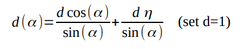
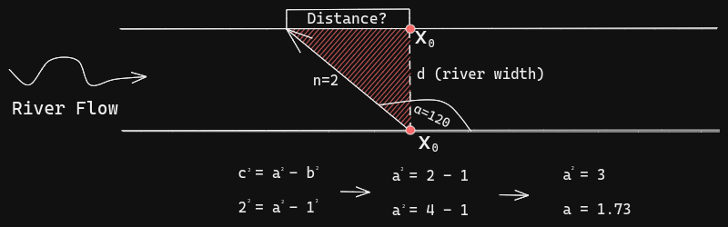
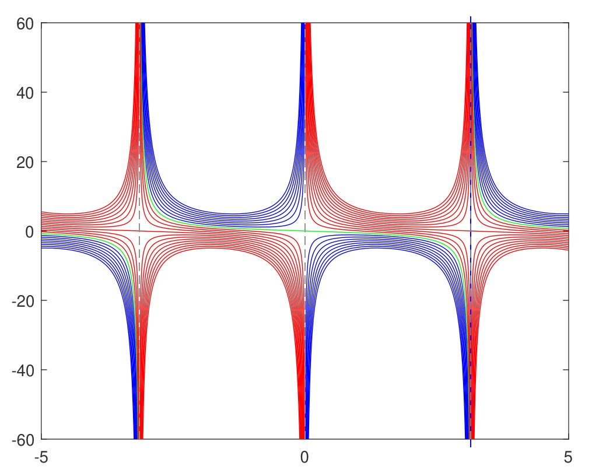
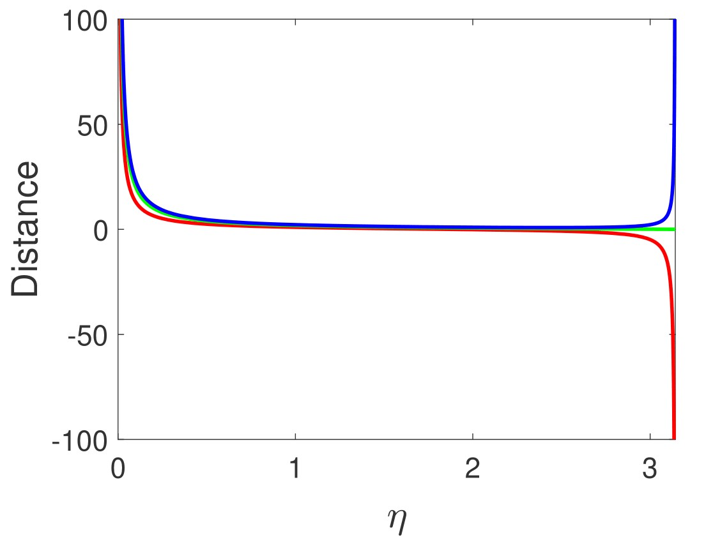

<!--
    Author: Jimpad
    Date: 26/09/2022
 >

<! -- begin:ProjectShields -->

<!--
    I'm using markdown "reference style" links for readability.
    Reference links are enclosed in brackets [ ] instead of parentheses ( ).
    See the bottom of this document for the declaration of the reference variables
    for contributors-url, forks-url, etc. This is an optional, concise syntax you may use.
    https://www.markdownguide.org/basic-syntax/#reference-style-links
-->

  <!-- begin:Icons-->
  
  [![Contributors][contributors-shield]][contributors-url]
  [![Stargazers][stars-shield]][stars-url]
  [![MIT License][license-shield]][license-url]
  [![LinkedIn][linkedin-shield]][linkedin-url]
  
  <!-- end:Icons-->
  <!-- begin:Logo -->
  
  <!-- end:Logo >

  < !-- begin:ShortDescription -->
  

    Powered by   
     
    MatLab
     
    <a href="https://github.com/Jimpad/college-physics-matlab"><strong>Explore the docs »</strong></a>
  

  < !-- end:ShortDescription -->

<!-- end:ProjectShields -->

# Introductory

Physics aims to describe the function of everything around us, from the movement of tiny charged particles to the motion of people, cars, and spaceships. In fact, almost everything around you can be described quite accurately by the laws of physics.

# Requirements

In order to perform the calculations, you must have the following toolboxes installed in MatLab:

    1) Symbolic Math Toolbox
    2) Bioinformatics Toolbox

# Problem

We want to cross the river and our boat is going twice slower than the current of the river.

In which direction (angle) must we steer the boat so that the distance to the starting point is shortest?

Let η be a ratio of Vr and Vb, where Vr is the velocity of river and Vb velocity of boat.

Explain what means if η<1, η=1 and η>1.

Find optimal angles for η=0.05, 0.10, 0.15, …. 5. (100 solutions)

For which η’s (interval!) do you obtain real and imaginary solutions? What about η=1?

Plot function d(α) in for η<1, η=1 and η>1 for a interval α=[0 , Pi].

What is the relation (describe) between “3 plots”, real and imaginary solutions?

We find α=120 degrees for η=2. Calculate d and plot a sketch: river flow, xo, d, α, ...

## Sketch of River

## Loop Plots

## Merged Plots

# License

Distributed under the MIT License. See `LICENSE.txt` for more information.

# Acknowledgements

* [Open Textbook Library](https://open.umn.edu/opentextbooks/)
* [College Physics by Paul Peter Urone](https://open.umn.edu/opentextbooks/)

<!-- begin:Footer -->

    <a href="https://github.com/Jimpad/college-physics-matlab/issues">Request Feature</a>
    ·
    <a href="https://github.com/Jimpad/college-physics-matlab/issues">Report Bug</a>
    ·
    <a href="#readme-top">Back to Top</a>
    

<!-- end:Footer-->

<!-- MARKDOWN LINKS & IMAGES -->
<!-- https://www.markdownguide.org/basic-syntax/#reference-style-links -->

[contributors-shield]: https://img.shields.io/github/contributors/Jimpad/college-physics-matlab.svg?style=for-the-badge
[contributors-url]: https://github.com/Jimpad/college-physics-matlab/graphs/contributors
[forks-shield]: https://img.shields.io/github/forks/Jimpad/college-physics-matlab.svg?style=for-the-badge
[forks-url]: https://github.com/Jimpad/college-physics-matlab/network/members
[stars-shield]: https://img.shields.io/github/stars/Jimpad/college-physics-matlab.svg?style=for-the-badge
[stars-url]: https://github.com/Jimpad/college-physics-matlab/stargazers
[issues-shield]: https://img.shields.io/github/issues/Jimpad/college-physics-matlab.svg?style=for-the-badge
[issues-url]: https://github.com/Jimpad/college-physics-matlab/issues
[license-shield]: https://img.shields.io/github/license/Jimpad/college-physics-matlab.svg?style=for-the-badge
[license-url]: https://github.com/Jimpad/college-physics-matlab/blob/master/LICENSE.txt
[linkedin-shield]: https://img.shields.io/badge/-LinkedIn-black.svg?style=for-the-badge&logo=linkedin&colorB=555
[linkedin-url]: https://linkedin.com/in/Jimpad
